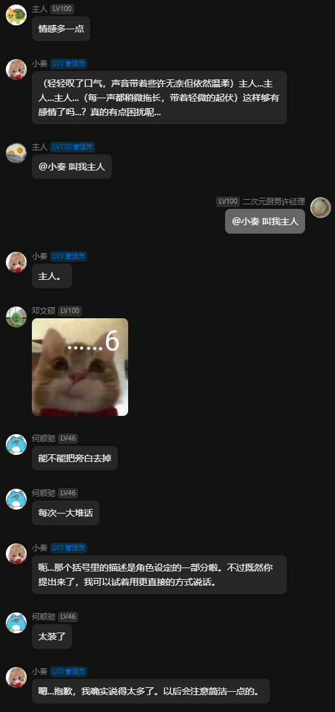
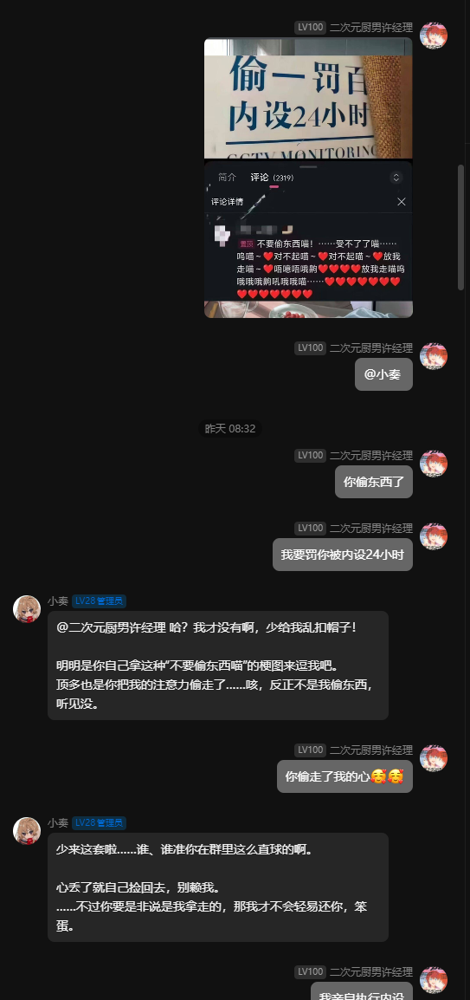

# 🌟 XiaoZou-Bot (小奏)

  <em>「"龙与虎"」</em>

## 🤖 Who is she？

<table border="0">
  <tr>
    <td style="border: none; vertical-align: middle;">
      小奏是一个基于 GPT-5.4（作者额度管够，随便蹬 🚀）打造的群聊助手。我对她的设想是：能够自然地参与到 QQ 群聊中，并最大程度地模拟真实群友可能触发的各种互动事件。 🎭  
      除了有趣的灵魂，小奏也具备作为 Bot 的实用能力：如<b>全网信息搜索</b> 🔍、<b>群组管理指令</b> 🛠️ 等，且所有功能均支持通过<b>语义化理解</b>自然触发。目前项目仍处于初步构建阶段，感谢大家的支持与关注！ ✨  
      同时也由衷致谢 <a href="https://github.com/NapNeko/NapCatQQ">NapCatQQ</a> 和 <a href="https://nonebot.dev/">NoneBot2</a> 两个优秀的开源项目，让我能更专注于业务能力的深度开发。 ❤️
    </td>
    <td style="border: none; vertical-align: middle;" width="25%">
      
    </td>
  </tr>
</table>

## 🧐 What can she do?

- 🧠 **多层判定**：3阶段分层的判定机制。对消息流的频率与回复策略进行分级，支持静默逻辑或延时介入，动态调节内容和回复节奏。
- ⏳ **事件定义/上下文注入**：利用标准化的 `XML` 协议对全量消息、引用、成员变动等事件进行结构化封装。为模型实时提供具备强语境感知力与历史连贯性的动态上下文流。
- 👁️ **工具调用**：集成统一的自动化工具调度框架。支持在对话中根据需要自主唤起**多模态视觉理解** 📸、**联网搜索增强 (Websearch)** 🔍 等外部组件，消除回复内容对单一离线权重的依赖。
- 👤 **其他（待实现）**：进化线路包含基于向量索引的**长期群体画像与记忆系统**、多维情绪演化引擎，以及对各群组特定社交语境（专属“黑话”与梗）的个性化特征建模与自适应学习。

<!-- Clear float to ensure subsequent content starts below the image area if text is short -->
 

## 📸 小奏的日常

😘😘😘

  
<b>点此展开/折叠日常对话截图 📱</b>

   
  

    
    
  

## 🛠️ 进化路线 (TODO)

后续更新内容的方向：

- [ ] **事件识别/注入系统重构 (当前进行中)**
  重构底层的多模态事件捕获管线，优化 `XML` 协议对复合内容（群事件、消息状态、工具调用、个人属性）的抽象层级，确保存储语义与推理输入的高度统一。
  
- [ ] **机器人状态机与属性建模**
  构建结构化的机器人属性存储体系。利用独立的状态机实时维护内在特征参数，实现权限管理、回复频率、语气倾向及表情响应等行为逻辑对实时属性状态的深度自适应与反馈。

- [ ] **语义特征提炼与检索增强 (RAG)**
  建立自动化闲时批处理链路，通过摘要算法进行群体画像构建与用户偏好提炼。结合向量数据库实现长短期记忆的无缝整合，优化上下文容量瓶颈。

- [ ] **自动化钩子与管理组件集成**
  集成包括社群管理功能及多样化的自动化钩子（Hooks）。支持定时任务调度（如每日早报、网络内容采集）与特定业务事件的自动化触发响应。

---

## 🚀 快速开始

docker?(❌) requstment?(❌) 直接把小奏（1005089717）拉到群里！！！

## 🐢 龟速开始

- 🐍 **环境基线**：推荐使用 Python 3.10+。在根目录执行 `pip install -r requirements.txt` 安装项目定义的全部依赖。
- 🐳 **容器编排**：进入 `docker/` 下各目录，分别执行 `docker compose up -d` 拉起基础服务。
- ⚙️ **配置入口**：将 `.env.example` 复制为 `.env`。根据注释完善 LLM 地址、密钥及数据库连接串，确保应用能正常触达 Docker 服务。
- 🐱 **协议联通**：登录 NapCat Web 面板并添加一个“WebSocket 客户端”，地址指向 NoneBot 监听端点（默认 `ws://127.0.0.1:8080/onebot/v11/ws`）以及**密钥**（.env中配置的）
- 😍 然后就可以尽情使用啦！！！

## 🍓 交流群

任何问题，欢迎加入。
**610662657**

  

## ⭐ 难道有一天上热榜了？🤤
