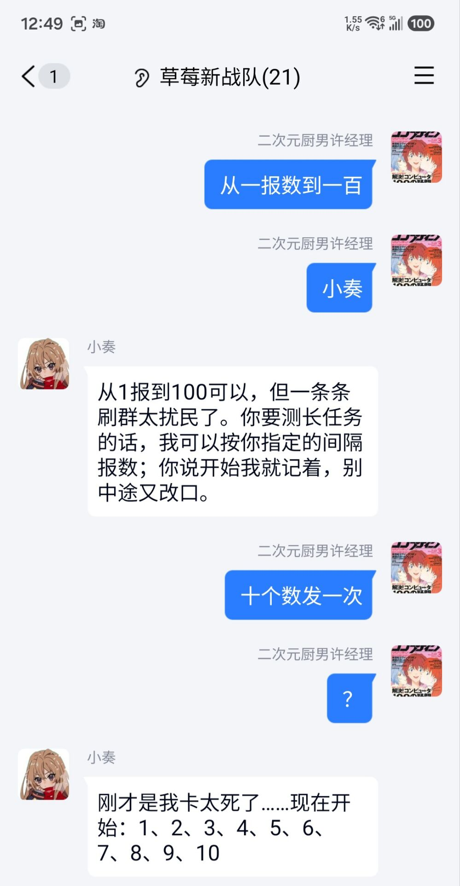
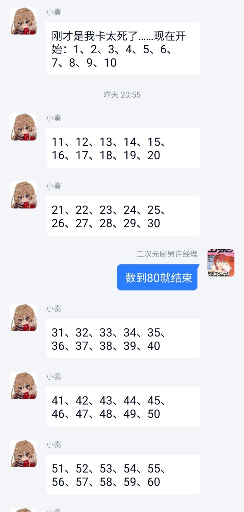
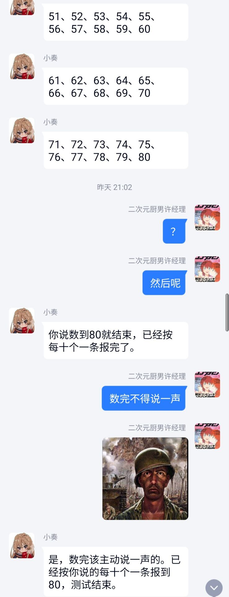

<div align="center">

# 🌟 XiaoZou-Bot (小奏)

<p align="center">
  <em>「龙与虎」</em>
</p>


</div>

<p align="center">
  <a href="README.md">简体中文</a> | <a href="README_EN.md">English</a>
</p>

## 🤖 项目简介

<table border="0">
  <tr>
    <td style="border: none; vertical-align: middle;">
      <b>XiaoZou-Bot</b> 是一个基于事件循环与自主决策机制（Tick-based Agent Loop）的 QQ 群聊 AI Agent。<br><br>
      不同于传统被动触发或单轮问答的聊天机器人，小奏采用 <b>Agent Harness</b> 架构，将群聊视为连续演进的认知场域：<br>
      • <b>跨 Tick 持续任务图谱</b>：内置任务状态机，支持多轮对话下的跨拍任务追踪、自我纠偏与主动推进。<br>
      • <b>认知与表达双层解耦</b>：高阶规划大脑（LLM Planner）负责态势感知与决策，独立表达层（Replyer）负责情绪化组稿与视觉对位。<br>
      • <b>事件溯源与完全可观测</b>：全局会话以不可变因果事件流落盘，具备全链路快照审计与因果离线回放能力。<br><br>
      本项目基于 <a href="https://github.com/NapNeko/NapCatQQ">NapCatQQ</a> 与 <a href="https://nonebot.dev/">NoneBot2</a> 构建，由衷感谢开源社区 ❤️
    </td>
    <td style="border: none; vertical-align: middle;" width="25%">
      
    </td>
  </tr>
</table>

## 🏗️ 核心设计

每个 Tick 的节奏固定：事件落库 → 折叠投影出当前时间线与活跃任务 → Planner 全局决策 → 按 Action 分发（任务管理 / 工具调用 / 组稿回复 / 自主沉寂），工具结果与决策再全部回写事件流，供下一拍观察。围绕这个循环：

- **事件溯源（Event Sourcing）**：消息、决策、工具结果、任务变更全部追加进不可变事件流；每个 Tick 通过投影（projection）折叠出当前上下文。全生命周期因果可追踪、可审计、可离线回放。
- **认知与表达解耦（Planner / Replyer 分层）**：Planner 只做态势感知与决策，输出结构化 Action；"怎么说"交给独立的 Replyer —— 人设语气（voice）、排版、配图与 VLM 多模态校验都由它完成，规划大脑不被渲染细节污染。
- **模型网格（Model Mesh）**：按角色（planner / replyer / caption）路由 LLM，支持同一模型跨多服务商随机分摊负载、按角色切换 `primary_failover`、故障自动冷却熔断。认知循环与具体模型端点完全脱钩。
- **群组沙箱（Scoped Sandbox）**：事件流、上下文与工具权限默认按 `group:<id>` 隔离；表情包等公共资产则在全局作用域共享。

## 🧰 能力一览

所有能力经统一 `Tool` 接口接入（`qqbot/services/agent_loop/tools/`，每个工具自带同名 `.md` 说明文档）：

| 分类 | 工具 |
|---|---|
| 表达互动 | `reply` `send_message` `poke` `emoji_like` `meme` `recall` |
| 信息检索 | `websearch` `webfetch` `search_history` `get_group_info` `get_member_info` `get_member_list` `get_group_honor` `get_stranger_info` |
| 群管操作 | `kick` `ban` `whole_ban` `set_admin` `set_card` `set_title` `set_essence` `group_notice` `set_group_name` `set_group_avatar` `leave_group` |
| 入群审批 | `get_pending_join_requests` `respond_to_group_join_request` |
| 节奏控制 | `wait`（自主沉寂，不打扰也是一种决策） |

## 🛠️ 进化路线 (Roadmap)

- [ ] **认知演进**：群体画像与长期记忆（空闲期批处理分析群内黑话与用户偏好，写回事件流）。
- [ ] **表达增强**：语音消息转译（引入 `audio_transcribe` 工具补全音频模态认知）。
- [ ] **基础设施**：CQRS 读模型优化（增加读表以避免每 Tick 重新折叠全量近期事件）。
- [ ] **资产治理**：Prompt 注册表扩展（新增运行时反馈、风控指南与多人格热切换）。

## 📸 效果图

<div align="center">
  <table border="0" style="border-collapse: collapse; margin: 20px 0;">
    <tr>
      <td align="center" style="padding: 10px; border: none; vertical-align: top;">
        
        <p style="margin-top: 10px; font-size: 13px; color: #64748b;">1. 开启任务 & 发起报数</p>
      </td>
      <td align="center" style="padding: 10px; border: none; vertical-align: top;">
        
        <p style="margin-top: 10px; font-size: 13px; color: #64748b;">2. 多轮插话与任务动态调整</p>
      </td>
      <td align="center" style="padding: 10px; border: none; vertical-align: top;">
        
        <p style="margin-top: 10px; font-size: 13px; color: #64748b;">3. 任务结束与自主多模态回复</p>
      </td>
    </tr>
  </table>
</div>


## 🚀 快速开始

直接把小奏（1005089717）拉到群里！


## 🐢 慢速开始

```bash
# 1. 启动 NapCat & PostgreSQL 容器
docker compose -f docker/postgres/compose.yml up -d
docker compose -f docker/napcat/compose.yml up -d

# 2. 初始化配置文件
cp .env.example .env
cp config/model_providers.example.json config/model_providers.json

# 3. 安装依赖并启动服务
pip install -r requirements.txt
python -m qqbot
```

### ⚙️ 配置说明

- **NapCat 协议对接**：在 NapCat Web 面板中添加 WebSocket 客户端，指向 `ws://<bot-host>:7500/onebot/v11/ws`。
- **模型路由配置 (`config/model_providers.json`)**：填入 API Key，并配置 `planner`（规划）、`replyer`（组稿）与 `caption`（表情包描述）角色的目标模型。
- **人设语气自定义 (`prompts/voice.md`)**：编辑 `qqbot/services/agent_loop/prompts/voice.md` 调整 Replyer 组稿时的人设卡（重启进程生效）。
- **API Lab 独立调试**：运行 `python -m qqbot.main_test` 可启动无 DB/无 LLM 的单机协议探针，方便测试 OneBot/NapCat 连通性与底层 API。


## 🍓 交流群

任何问题，欢迎加入。
**610662657**
<div align="left">
  
</div>


## ⭐ 难道有一天上热榜了？🤤
<a href="https://www.star-history.com/?repos=fayev1t%2FXiaoZou-Bot&type=date&legend=top-left">
 <picture>
   <source media="(prefers-color-scheme: dark)" srcset="https://api.star-history.com/chart?repos=fayev1t/XiaoZou-Bot&type=date&theme=dark&legend=top-left" />
   <source media="(prefers-color-scheme: light)" srcset="https://api.star-history.com/chart?repos=fayev1t/XiaoZou-Bot&type=date&legend=top-left" />
   
 </picture>
</a>
