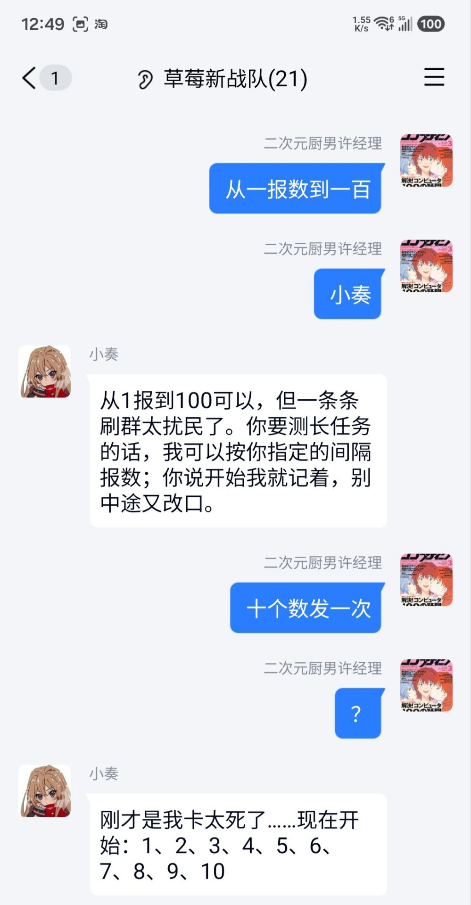
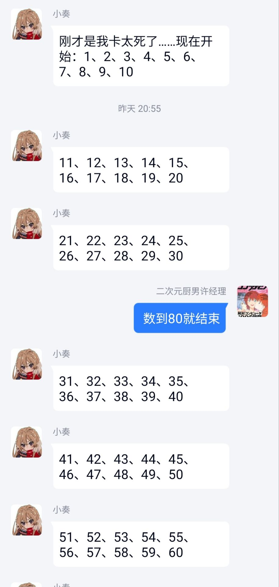
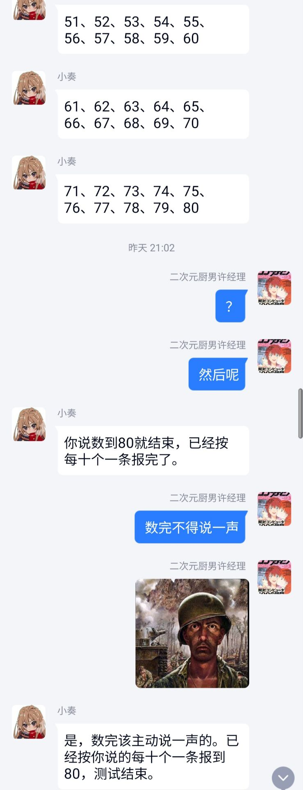

<div align="center">

# 🌟 XiaoZou-Bot (XiaoZou)

<p align="center">
  <em>"Toradora!"</em>
</p>


</div>

<p align="center">
  <a href="README.md">简体中文</a> | <a href="README_EN.md">English</a>
</p>

## 🤖 Introduction

<table border="0">
  <tr>
    <td style="border: none; vertical-align: middle;">
      <b>XiaoZou-Bot</b> is a QQ group chat AI Agent based on an event loop and decision mechanism (Tick-based Loop).<br><br>
      Compared to other qqbots, XiaoZou built on the <b>Agent Loop</b> architecture naturally possesses the following characteristics:<br>
      • <b>Cross-Tick Task Management</b>: Built-in task state machine, naturally supporting persistent tasks.<br>
      • <b>Autonomous Behavior Decision</b>: When to speak, when to stay silent, whether to use tools are all judged by the model itself, rather than rule-triggered; native QQ capabilities such as @mentions, quotes, memes, and group moderation are all in her toolbox.<br>
      • <b>Native Multimodality</b>: Images enter the model's view directly just like text, without losing other details.<br><br>
      Meanwhile, XiaoZou is also built on the <a href="https://github.com/NapNeko/NapCatQQ">NapCatQQ</a> and <a href="https://nonebot.dev/">NoneBot2</a> projects, heartfelt thanks ❤️
    </td>
    <td style="border: none; vertical-align: middle;" width="25%">
      
    </td>
  </tr>
</table>


## ✨ Core Design

The project is refactored based on the **Agent Loop / Harness** philosophy, featuring the following core design characteristics:

- **Event Sourcing**: Messages, decisions, tool results, and task changes are all appended as immutable events to the same event stream. The conversation context and task state are folded and projected from this stream. Each event carries a correlation / causation chain, providing a complete, replayable, and traceable record.
- **LLM-as-Planner**: Each Tick projects the event stream into a decision context (timeline + active tasks) and hands it to the model, which provides a structured action sequence—starting a task, invoking tools, advancing or finalizing tasks, or idling.
- **Capabilities as Tools**: Abilities like replying, querying, and group moderation are all accessed via a unified `Tool` protocol. Tools come with their own usage instructions and visibility controlled by scope, making it convenient to extend capabilities.
- **Modular Prompting**: The System Prompt is split into independent sections by responsibility (identity / behavior rules / protocol format / tool usage), so persona changes and rule tuning can be performed independently.
- **Scope Isolation**: Conversation event streams, contexts, and tool permissions are sandboxed by default with group (`group:<id>`) boundaries, ensuring decision spaces for each group chat do not interfere with each other; meanwhile, public assets like sticker collections are shared across groups under a global scope.

## 🛠️ Roadmap (TODO)

- [ ] **Complete the Toolset**: Rework and re-enable the temporarily offline web-search and moderation tools (mute, recall, etc.).
- [ ] **Voice Message Transcribing**: Introduce `audio_transcribe` tool to transcribe audio (while VLM handles images natively) to compensate for VLM's native voice limitations.
- [ ] **Group Profiles & Long-term Memory**: Off-peak batch analysis to summarize user preferences and group slang/lore, writing them back to the event stream.
- [ ] **CQRS Read Model Optimization**: Avoid refolding all recent events every tick by adding read tables for direct query path optimization.
- [ ] **Expand Prompt Registry**: Add risk control guidelines, runtime feedback, and multi-persona hot-swapping sections.


## 📸 Screenshots

<div align="center">
  <table border="0" style="border-collapse: collapse; margin: 20px 0;">
    <tr>
      <td align="center" style="padding: 10px; border: none; vertical-align: top;">
        
        <p style="margin-top: 10px; font-size: 13px; color: #64748b;">1. Launch Task & Start Counting</p>
      </td>
      <td align="center" style="padding: 10px; border: none; vertical-align: top;">
        
        <p style="margin-top: 10px; font-size: 13px; color: #64748b;">2. Concurrent Chat & Task Adjustment</p>
      </td>
      <td align="center" style="padding: 10px; border: none; vertical-align: top;">
        
        <p style="margin-top: 10px; font-size: 13px; color: #64748b;">3. Task Completion & Multimodal Reply</p>
      </td>
    </tr>
  </table>
</div>


## 🚀 Quick Start

Simply invite XiaoZou (1005089717) to your group chat!

## 🐢 Slow Start

```bash
# 1. Start NapCat & PostgreSQL containers
docker compose -f docker/postgres/compose.yml up -d
docker compose -f docker/napcat/compose.yml up -d
# 2. Copy config and run (VLM multimodal model is required)
cp .env.example .env
pip install -r requirements.txt
python -m qqbot
```
- **Connect NapCat**: Add a WebSocket client on the Web Panel pointing to `ws://<bot-host>:7500/onebot/v11/ws`.
- **Customize Persona**: Edit the Voice section of `qqbot/services/agent_loop/tools/send_message.md` (the character card only shapes outgoing message text; reboot the process to take effect).

## 🍓 Community Group

For any questions, feel free to join our QQ group:
**610662657**
<div align="left">
  
</div>

## ⭐ Star History 🤤
<a href="https://www.star-history.com/?repos=fayev1t%2FXiaoZou-Bot&type=date&legend=top-left">
 <picture>
   <source media="(prefers-color-scheme: dark)" srcset="https://api.star-history.com/chart?repos=fayev1t/XiaoZou-Bot&type=date&theme=dark&legend=top-left" />
   <source media="(prefers-color-scheme: light)" srcset="https://api.star-history.com/chart?repos=fayev1t/XiaoZou-Bot&type=date&legend=top-left" />
   
 </picture>
</a>
